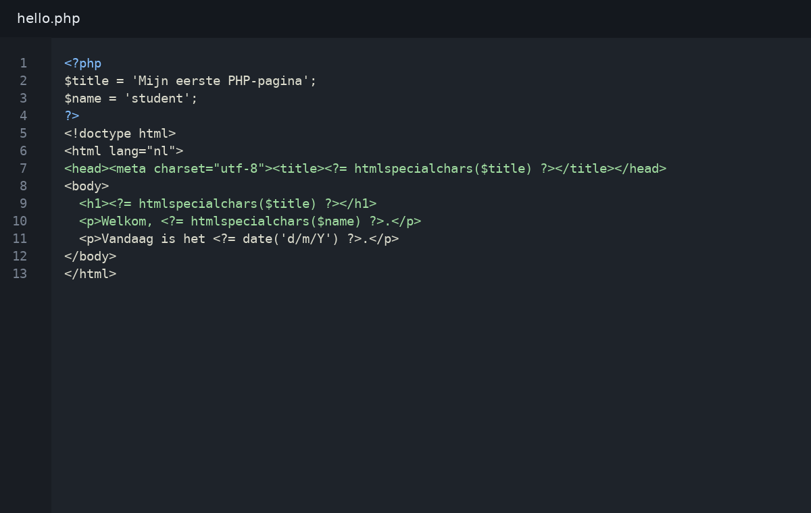
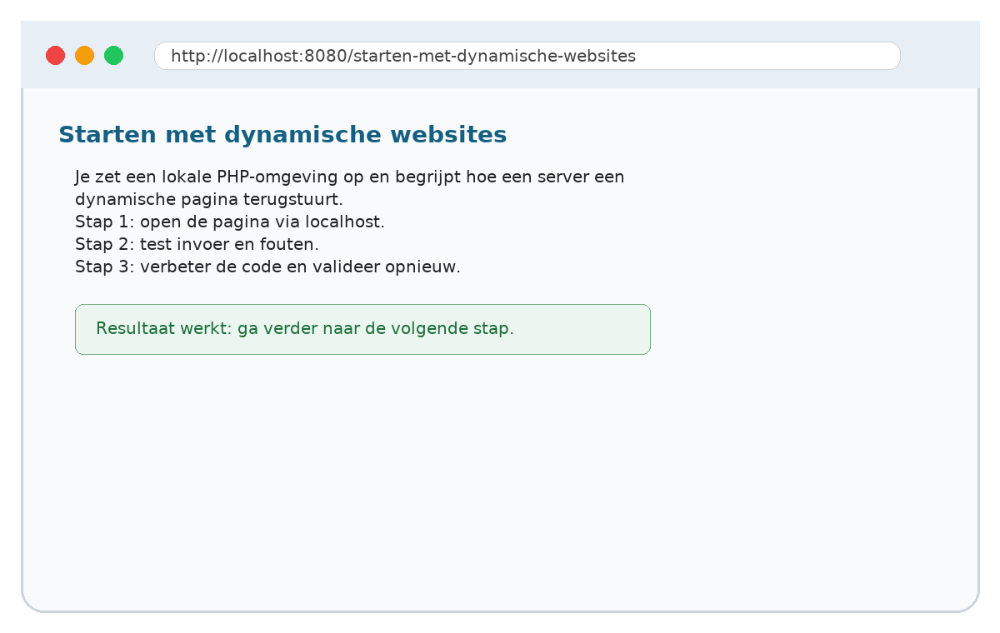

# 01. Starten met dynamische websites

## Wat je leert
Je zet een lokale PHP-omgeving op en begrijpt hoe een server een dynamische pagina terugstuurt.

## Kernbegrippen
- client-server
- localhost
- document root
- index.php

## Theorie in het kort
Lees dit deel eerst. De theorie is beperkt tot wat je nodig hebt om de praktijkstappen te begrijpen. Noteer onbekende woorden in je begrippenlijst.

## Stap voor stap




1. Open het startbestand uit `snippets/`.
2. Typ de code niet blind over: markeer eerst wat je al begrijpt.
3. Pas één regel aan en test het resultaat in de browser.
4. Noteer de foutmelding als iets niet werkt.
5. Verbeter de code en commit je werk met een duidelijke boodschap.

## Invulopdracht
| Vraag | Antwoord |
|---|---|
| Welke bestanden heb je aangepast? |  |
| Welke foutmelding kreeg je eventueel? |  |
| Welke regel loste het probleem op? |  |
| Wat zou je volgende keer anders doen? |  |

## Codefragment
```php
<?php
$title = 'Mijn eerste PHP-pagina';
$name = 'student';
?>
<!doctype html>
<html lang="nl">
<head><meta charset="utf-8"><title><?= htmlspecialchars($title) ?></title></head>
<body>
  <h1><?= htmlspecialchars($title) ?></h1>
  <p>Welkom, <?= htmlspecialchars($name) ?>.</p>
  <p>Vandaag is het <?= date('d/m/Y') ?>.</p>
</body>
</html>
```

## Oefeningen
1. Basis: Maak een startpagina die je naam en de huidige datum toont.
2. Verdieping: voeg een extra foutcontrole of uitbreiding toe.
3. Reflectie: leg in maximaal vijf zinnen uit hoe de server, PHP en de browser samenwerken in deze oefening.
