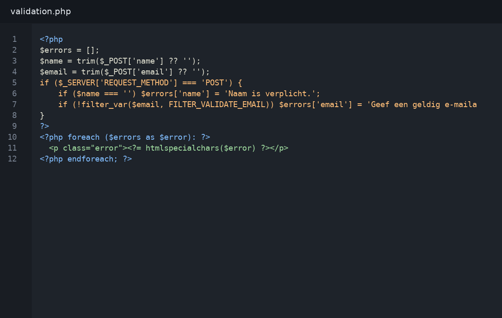
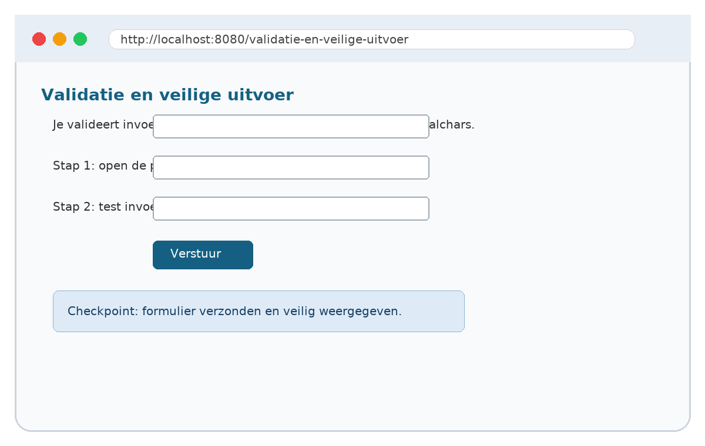

# 04. Validatie en veilige uitvoer

## Wat je leert
Je valideert invoer en toont gebruikersdata veilig met htmlspecialchars.

## Kernbegrippen
- trim
- filter_input
- htmlspecialchars
- foutmelding

## Theorie in het kort
Lees dit deel eerst. De theorie is beperkt tot wat je nodig hebt om de praktijkstappen te begrijpen. Noteer onbekende woorden in je begrippenlijst.

## Stap voor stap




1. Open het startbestand uit `snippets/`.
2. Typ de code niet blind over: markeer eerst wat je al begrijpt.
3. Pas één regel aan en test het resultaat in de browser.
4. Noteer de foutmelding als iets niet werkt.
5. Verbeter de code en commit je werk met een duidelijke boodschap.

## Invulopdracht
| Vraag | Antwoord |
|---|---|
| Welke bestanden heb je aangepast? |  |
| Welke foutmelding kreeg je eventueel? |  |
| Welke regel loste het probleem op? |  |
| Wat zou je volgende keer anders doen? |  |

## Codefragment
```php
<?php
$errors = [];
$name = trim($_POST['name'] ?? '');
$email = trim($_POST['email'] ?? '');
if ($_SERVER['REQUEST_METHOD'] === 'POST') {
    if ($name === '') $errors['name'] = 'Naam is verplicht.';
    if (!filter_var($email, FILTER_VALIDATE_EMAIL)) $errors['email'] = 'Geef een geldig e-mailadres in.';
}
?>
<?php foreach ($errors as $error): ?>
  <p class="error"><?= htmlspecialchars($error) ?></p>
<?php endforeach; ?>
```

## Oefeningen
1. Basis: Voeg foutmeldingen toe bij ontbrekende of ongeldige invoer.
2. Verdieping: voeg een extra foutcontrole of uitbreiding toe.
3. Reflectie: leg in maximaal vijf zinnen uit hoe de server, PHP en de browser samenwerken in deze oefening.
