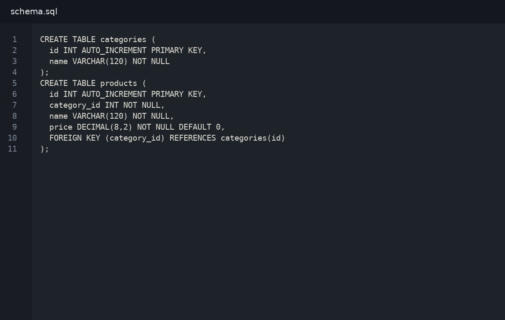
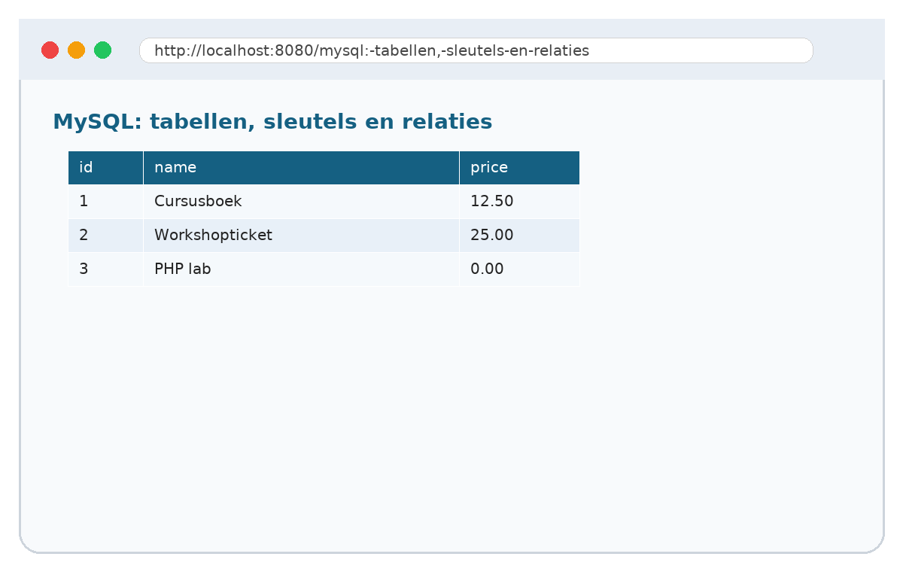

# 05. MySQL: tabellen, sleutels en relaties

## Wat je leert
Je ontwerpt een eenvoudige relationele databank en leest een ERD als plan voor je code.

## Kernbegrippen
- tabel
- primary key
- foreign key
- relatie

## Theorie in het kort
Lees dit deel eerst. De theorie is beperkt tot wat je nodig hebt om de praktijkstappen te begrijpen. Noteer onbekende woorden in je begrippenlijst.

## Stap voor stap




1. Open het startbestand uit `snippets/`.
2. Typ de code niet blind over: markeer eerst wat je al begrijpt.
3. Pas één regel aan en test het resultaat in de browser.
4. Noteer de foutmelding als iets niet werkt.
5. Verbeter de code en commit je werk met een duidelijke boodschap.

## Invulopdracht
| Vraag | Antwoord |
|---|---|
| Welke bestanden heb je aangepast? |  |
| Welke foutmelding kreeg je eventueel? |  |
| Welke regel loste het probleem op? |  |
| Wat zou je volgende keer anders doen? |  |

## Codefragment
```sql
CREATE TABLE categories (
  id INT AUTO_INCREMENT PRIMARY KEY,
  name VARCHAR(120) NOT NULL
);
CREATE TABLE products (
  id INT AUTO_INCREMENT PRIMARY KEY,
  category_id INT NOT NULL,
  name VARCHAR(120) NOT NULL,
  price DECIMAL(8,2) NOT NULL DEFAULT 0,
  FOREIGN KEY (category_id) REFERENCES categories(id)
);
```

## Oefeningen
1. Basis: Ontwerp een databank voor producten en categorieën.
2. Verdieping: voeg een extra foutcontrole of uitbreiding toe.
3. Reflectie: leg in maximaal vijf zinnen uit hoe de server, PHP en de browser samenwerken in deze oefening.
