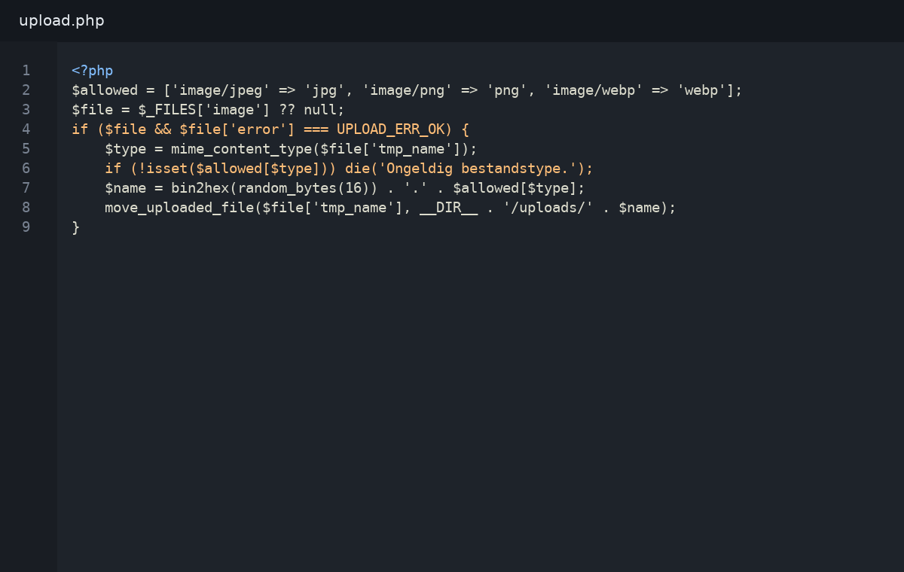
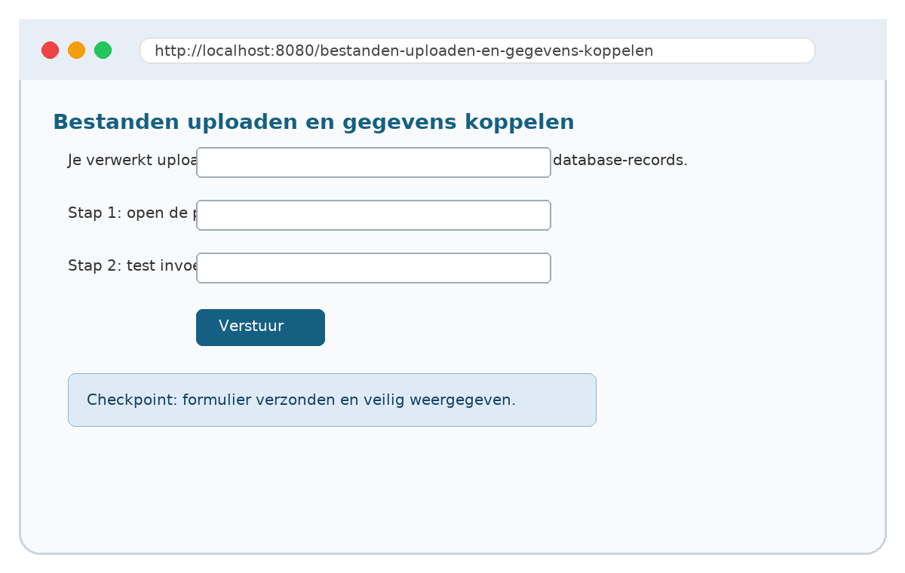

# 09. Bestanden uploaden en gegevens koppelen

## Wat je leert
Je verwerkt uploads gecontroleerd en koppelt afbeeldingen aan database-records.

## Kernbegrippen
- multipart
- MIME-type
- random naam
- uploadmap

## Theorie in het kort
Lees dit deel eerst. De theorie is beperkt tot wat je nodig hebt om de praktijkstappen te begrijpen. Noteer onbekende woorden in je begrippenlijst.

## Stap voor stap




1. Open het startbestand uit `snippets/`.
2. Typ de code niet blind over: markeer eerst wat je al begrijpt.
3. Pas één regel aan en test het resultaat in de browser.
4. Noteer de foutmelding als iets niet werkt.
5. Verbeter de code en commit je werk met een duidelijke boodschap.

## Invulopdracht
| Vraag | Antwoord |
|---|---|
| Welke bestanden heb je aangepast? |  |
| Welke foutmelding kreeg je eventueel? |  |
| Welke regel loste het probleem op? |  |
| Wat zou je volgende keer anders doen? |  |

## Codefragment
```php
<?php
$allowed = ['image/jpeg' => 'jpg', 'image/png' => 'png', 'image/webp' => 'webp'];
$file = $_FILES['image'] ?? null;
if ($file && $file['error'] === UPLOAD_ERR_OK) {
    $type = mime_content_type($file['tmp_name']);
    if (!isset($allowed[$type])) die('Ongeldig bestandstype.');
    $name = bin2hex(random_bytes(16)) . '.' . $allowed[$type];
    move_uploaded_file($file['tmp_name'], __DIR__ . '/uploads/' . $name);
}
```

## Oefeningen
1. Basis: Voeg een productafbeelding toe via upload.
2. Verdieping: voeg een extra foutcontrole of uitbreiding toe.
3. Reflectie: leg in maximaal vijf zinnen uit hoe de server, PHP en de browser samenwerken in deze oefening.
